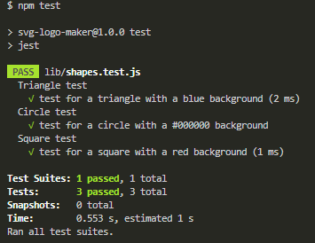

# Simple SVG Logo Maker


## Description

  This is a SVG logo file generator. It is a command line based utility that prompts the user for information about the logo text, text color, shape, and shape color. The logo text is limited to three characters.
  The color options allow for simple color keywords or hexadecimal number (i.e. #FFFFFF). Once the user answers all prompts, then a logo.svg file is generated to the output folder. This file creation
  is indicated to the user with a console message ("Generated logo.svg"). The file can then be opened in browser to view the newly generated logo.svg. The user can then use this SVG 300x200 pixel image to use for their projects.

  ## Table of Contents

  * [Installation](#installation)
  * [Usage](#usage)
  * [Contribution](#contribution)
  * [Tests](#test)
  * [Questions](#questions)
  * [License](#license)

  ## Installation

  1. To install just clone this repo:
  ```
  git clone git@github.com:hculp/SVG-logo-maker.git
  ```
  2. Install inquirer and jest with npm:
  ```
  npm i inquirer
  npm i jest
  ```

  ## Usage

  To use the this SVG logo generator, use node's npm start command.
  ```
  npm start
  ```
  Follow the prompts till completion. **Then, you'll have your generated a logo.svg!**\
  There are example generated SVG logos in the [examples folder](./examples/). Here is an example image of a logo.svg as well.
  
  
  Here is a link to a demo [video]() using the command line utility.
  ## Contribution

  Contribution falls under open MIT license.

  ## Tests

  To run testing, simply run 'npm run test' after installing the dependecies.
  ```
  npm run test
  ```
  What the test results should like: <br/>
  

  ## Questions

  Send any questions or feedback to the following contacts:

  * GitHub: [https://github.com/hculp](https://github.com/hculp)
  * Email: [howacul@gmail.com](mailto:howacul@gmail.com)
  
  ## License

    Copyright (C) 2023 Houston Culpepper.     
    
    Distributed under the MIT License.
  [Link to MIT license](https://choosealicense.com/licenses/mit)
